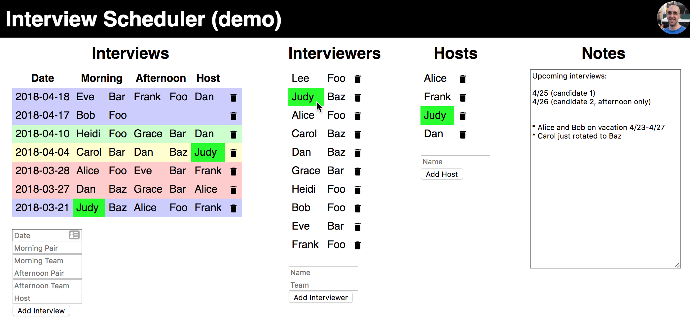

# Interview Scheduler

A React app used to schedule pairing interviews. It sorts people based on how recently they have interviewed or hosted. It also highlights all instances of a name on hover to quickly show when a person (or team) has interviewed/hosted.



## Getting started

Run `npm install` to install dependencies.

### Firebase

All data is stored in [firebase](https://firebase.google.com/). You will need to create a firebase account, configure authentication, and configure database rules. It is recommended that you create databases for development, testing, and production.

#### Configuring firebase authentication

The app uses Google authentication. To enable this:
1. Go to the firebase console
1. Click `Authentication`
1. Click `Sign-In Method`
1. Click `Google`, toggle to enable it, and click `Save`

If you plan on hosting the application on a domain, you must add that domain to `Authorized domains` under `Sign-In Method`

#### Configuring firebase database(s)

##### For tests

The rules for your test database must allow any user to read and write:

```
{
  "rules": {
    ".read": "true",
    ".write": "true"
  }
}
```

##### For dev/prod

You have more freedom with the rules for your dev and prod apps. You could allow any authenticated user to read/write, any user to read and specific users to write, or specific user to read and write. You can also filter users by email domain. See the examples below.

**Note:** To allow users to write without specifying them as admins in the database, you must set the `REACT_APP_FIREBASE_EVERYONE_CAN_WRITE` environment variable so that the forms are visible.

###### Any authenticated user can read/write

```
{
  "rules": {
    ".read": "auth.token.email_verified == true",
    ".write": "auth.token.email_verified == true"
  }
}
```

###### Any authenticated user from a specific email domain can read/write

```
{
  "rules": {
    ".read": "auth.token.email_verified == true && auth.token.email.matches(/.*@<domain>$/)",
    ".write": "auth.token.email_verified == true && auth.token.email.matches(/.*@<domain>$/)"
  }
}
```

###### Specific users can write

```
{
  "rules": {
    "admins": {
      ".read": false,
      ".write": false
    },
    ".read": "...",
    ".write": "auth.token.email_verified == true && root.child('admins').child(auth.token.email.replace('.', '%2E')).exists()"
  }
}
```

The list of admins is specified in the database itself. Note that keys cannot contain `.`, so they must be replaced with `%2E`. For example:

```
{
  "admins": {
    "admin1@domain%2Ecom": "true",
    "admin2@domain%2Ecom": "true"
  }
}
```

### Environment variables

The following environment variables are required to connect to firebase. They can be found by going to the firebase console, clicking the gear icon and going to `Project Settings`, then clicking `Add Firebase to your web app`.

* `REACT_APP_FIREBASE_API_KEY`
* `REACT_APP_FIREBASE_AUTH_DOMAIN`
* `REACT_APP_FIREBASE_DATABASE_URL`
* `REACT_APP_FIREBASE_MESSAGING_SENDER_ID`
* `REACT_APP_FIREBASE_PROJECT_ID`
* `REACT_APP_FIREBASE_STORAGE_BUCKET`

The following are optional:

* `REACT_APP_FIREBASE_EVERYONE_CAN_WRITE` (If set, any authenticated user can see forms and edit notes. This is separate from firebase's database rules)
* `REACT_APP_TITLE` (Sets the page title, defaults to `Interview Scheduler`)

## Running the app

Ensure you have [configured firebase](#firebase) and set the required [environment variables](#environment-variables). Run `npm start`.

## Running the tests

Ensure you have [configured firebase](#firebase) and set the required [environment variables](#environment-variables). Run `npm test`.
